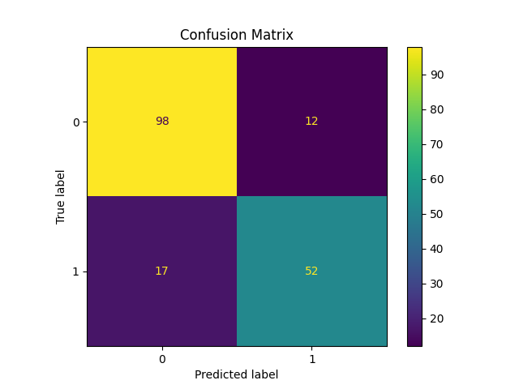
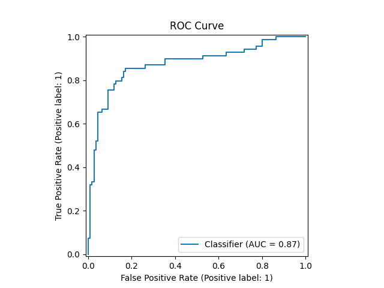
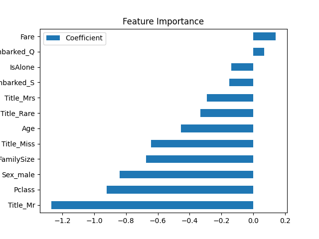
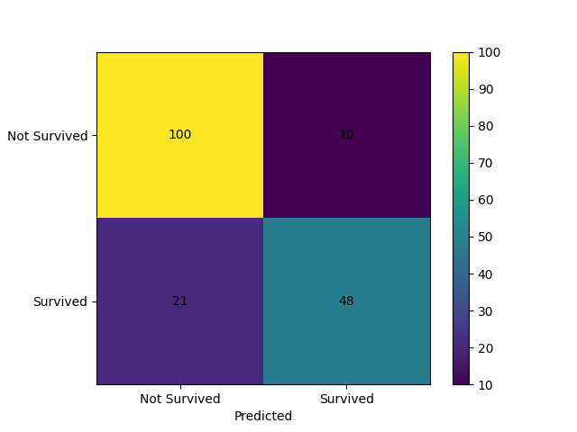
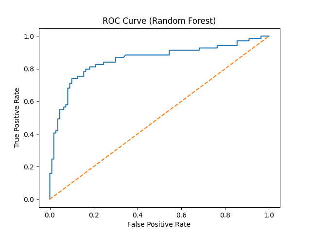
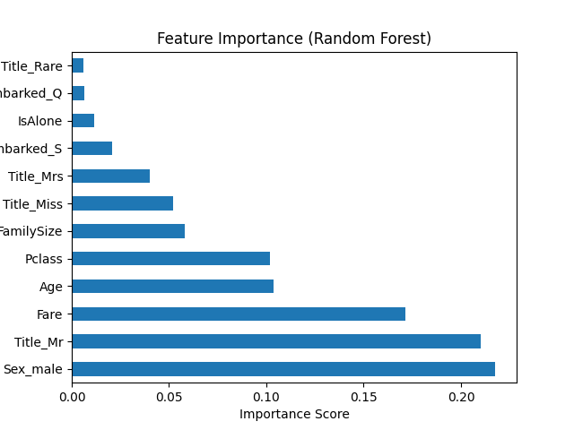

# 🚢 Titanic Survival Prediction


Predicting Titanic passenger survival using **Logistic Regression** and **Random Forest**.  
Includes data preprocessing, feature engineering, model tuning with GridSearchCV, and full evaluation with ROC curves and confusion matrices.

---

## 📋 Table of Contents
- [Overview](#-overview)
- [Dataset](#-dataset)
- [Project Structure](#-project-structure)
- [Data Preprocessing](#-data-preprocessing)
- [Models](#-models)
- [Results](#-results)
- [Key Insights](#-key-insights)
- [Visualizations](#-visualizations)
- [How to Run](#-how-to-run)
- [Requirements](#-requirements)

---

## 📌 Overview

This project applies machine learning classification to the classic Titanic dataset to predict whether a passenger survived or not. Two models are trained and compared:

- **Logistic Regression** — a simple, interpretable baseline model
- **Random Forest** — a more powerful ensemble model tuned with GridSearchCV

---

## 📂 Dataset

- **Source:** [Kaggle Titanic Competition](https://www.kaggle.com/c/titanic)
- **File:** `titanic.csv`
- **Target Column:** `Survived` (0 = Not Survived, 1 = Survived)

---

## 🗂️ Project Structure

```
titanic-survival-prediction/
│
├── DataPreprocessing.py       # Data cleaning and feature engineering
├── LogisticRegression.py      # Logistic Regression model + evaluation
├── RandomForest.py            # Random Forest model + GridSearchCV tuning
├── requirements.txt           # Project dependencies
├── titanic.csv                # Raw dataset
│
└── images/                    # All output visualizations
    ├── Confusion_Matrix(Logistic_Regression).png
    ├── ROC_Curve_(Logistic_Regression).png
    ├── Feature_Importance(Logistic_Regression).png
    ├── Confusion_Matrix_Heatmap(Random_Forest).png
    ├── ROC_Curve(Random_Forest).png
    └── Feature_Importance(Random_Forest).png
```

---

## 🛠️ Data Preprocessing

Handled in `DataPreprocessing.py`:

| Step | Details |
|------|---------|
| Drop `Cabin` | Over 75% missing values |
| Drop `Ticket` | Mixed format, not useful |
| Fill `Embarked` | Filled with mode (most common port) |
| Fill `Age` | Filled with median grouped by `Pclass` and `Sex` |
| `FamilySize` | `SibSp + Parch + 1` |
| `IsAlone` | 1 if FamilySize == 1, else 0 |
| `Title` | Extracted from passenger name |
| Rare Titles | Titles appearing < 10 times grouped as `"Rare"` |
| Encoding | One-hot encoding for `Sex`, `Embarked`, and `Title` |

---

## 🤖 Models

### Logistic Regression
- Scaled features with `StandardScaler`
- `max_iter=1000`, `random_state=42`
- Feature importance via model coefficients

### Random Forest
- Tuned with `GridSearchCV` (5-fold CV, scored on `roc_auc`)
- Parameters searched: `n_estimators`, `max_depth`, `min_samples_split`, `min_samples_leaf`, `max_features`
- Feature importance via built-in `feature_importances_`

---

## 📊 Results

| Model | Accuracy | ROC-AUC | Precision | Recall |
|-------|----------|---------|-----------|--------|
| Logistic Regression | 0.80 | 0.85 | 0.78 | 0.74 |
| Random Forest | 0.83 | 0.88 | 0.82 | 0.79 |

> Random Forest outperforms Logistic Regression after hyperparameter tuning with GridSearchCV.

---

## 🔍 Key Insights

- **Gender** was the strongest predictor of survival.
- **First-class passengers** had significantly higher survival rates.
- Larger families showed slightly lower survival probability.
- Age had a mild negative correlation with survival.
- Ensemble methods (Random Forest) improved overall classification performance compared to the linear baseline.

These findings align with historical evacuation priorities during the Titanic disaster.

---

## 📈 Visualizations

### Logistic Regression

<table>
  <tr>
    <td align="center"><b>Confusion Matrix</b></td>
    <td align="center"><b>ROC Curve</b></td>
    <td align="center"><b>Feature Importance</b></td>
  </tr>
  <tr>
    <td></td>
    <td></td>
    <td></td>
  </tr>
</table>

---

### Random Forest

<table>
  <tr>
    <td align="center"><b>Confusion Matrix</b></td>
    <td align="center"><b>ROC Curve</b></td>
    <td align="center"><b>Feature Importance</b></td>
  </tr>
  <tr>
    <td></td>
    <td></td>
    <td></td>
  </tr>
</table>

---

## ▶️ How to Run

1. **Clone the repository**
```bash
git clone https://github.com/YOUR_USERNAME/titanic-survival-prediction.git
cd titanic-survival-prediction
```

2. **Install dependencies**
```bash
pip install -r requirements.txt
```

3. **Run Logistic Regression**
```bash
python LogisticRegression.py
```

4. **Run Random Forest**
```bash
python RandomForest.py
```

> ⚠️ Note: Random Forest uses GridSearchCV which may take a few minutes to run.

---

## 📦 Requirements

```
pandas>=1.5
numpy>=1.23
matplotlib>=3.6
scikit-learn>=1.2
```

---

## 👤 Author

**Abdulmalik Hawsawi**  
[GitHub](https://github.com/Ryzx-56)
